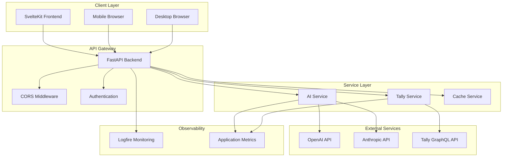
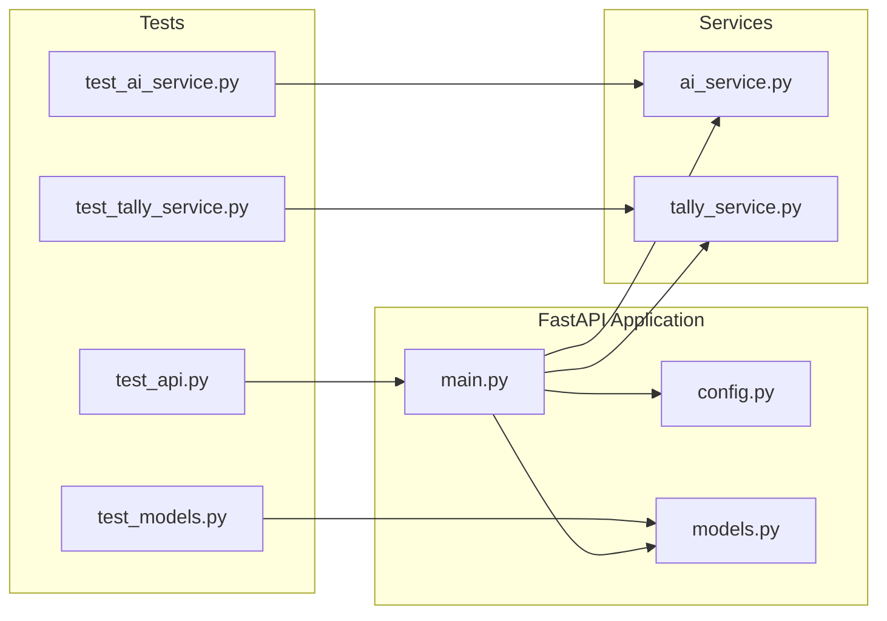
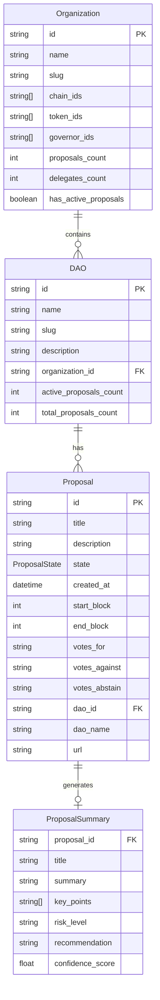
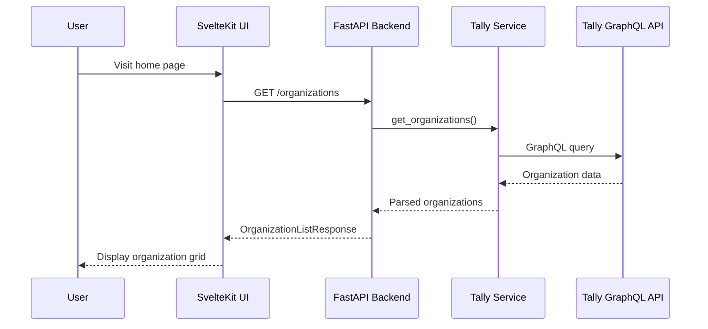
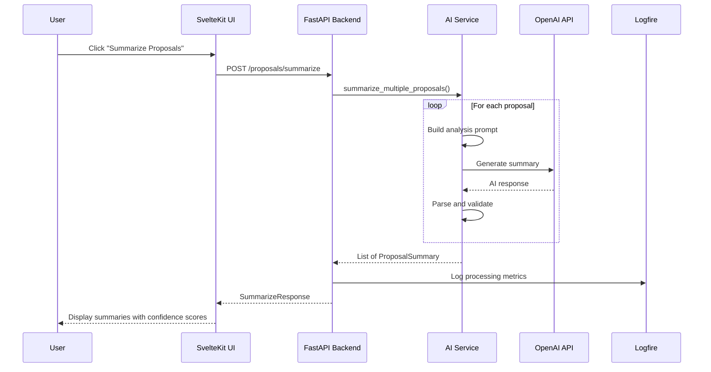
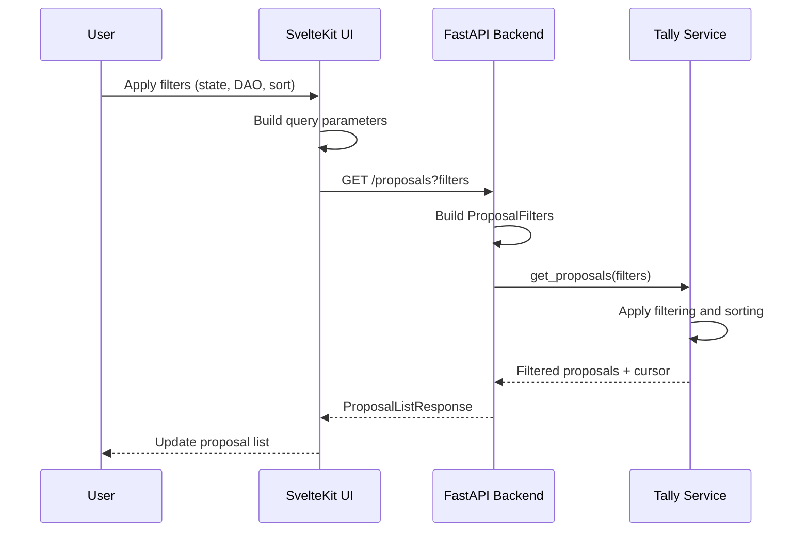

# Quorum AI - High-Level Architecture

## Table of Contents
- [1. System Overview](#1-system-overview)
- [2. Technology Stack](#2-technology-stack)
- [3. System Architecture](#3-system-architecture)
- [4. Backend Architecture](#4-backend-architecture)
- [5. Frontend Architecture](#5-frontend-architecture)
- [6. Data Models](#6-data-models)
- [7. Data Flow](#7-data-flow)
- [8. External Integrations](#8-external-integrations)
- [9. Feature Mapping](#9-feature-mapping)
- [10. Development Workflow](#10-development-workflow)
- [11. Testing Strategy](#11-testing-strategy)
- [12. Deployment & Infrastructure](#12-deployment--infrastructure)
- [13. Security & Performance](#13-security--performance)
- [14. Scalability Considerations](#14-scalability-considerations)

## 1. System Overview

Quorum AI is a comprehensive platform for analyzing and summarizing DAO (Decentralized Autonomous Organization) proposals using artificial intelligence. The system enables users to discover organizations, browse proposals, and receive AI-powered summaries with risk assessments and recommendations.

### Core Capabilities
- **DAO Discovery**: Browse and explore decentralized autonomous organizations
- **Proposal Management**: View, filter, and sort governance proposals
- **AI Summarization**: Generate intelligent summaries of complex proposals
- **Risk Assessment**: Evaluate potential risks and provide recommendations
- **Real-time Data**: Access up-to-date proposal states and voting information

### Target Users
- DAO members and token holders
- Governance participants
- DeFi researchers and analysts
- Web3 community managers

## 2. Technology Stack

| Layer | Technology | Version | Purpose |
|-------|------------|---------|---------|
| **Backend** | Python | 3.12+ | Core application runtime |
| | FastAPI | 0.115.0+ | REST API framework |
| | Pydantic | 2.10.0+ | Data validation and serialization |
| | Pydantic AI | 0.0.14+ | AI integration framework |
| | UV | Latest | Dependency management |
| | Logfire | 2.4.0+ | Observability and monitoring |
| **Frontend** | SvelteKit | 2.5.27+ | Full-stack web framework |
| | Svelte | 5.0.0+ | Reactive UI framework |
| | TypeScript | 5.5.0+ | Type-safe JavaScript |
| | Tailwind CSS | 4.1.10+ | Utility-first CSS framework |
| | Bun | Latest | Package manager and runtime |
| **AI Services** | OpenAI | Latest | GPT models for summarization |
| | Anthropic | Latest | Claude models for analysis |
| **External APIs** | Tally API | Latest | DAO and proposal data |
| **Development** | pytest | 8.0.0+ | Backend testing |
| | Ruff | 0.8.0+ | Python linting and formatting |
| | MyPy | 1.8.0+ | Static type checking |
| | Docker | Latest | Containerization |

## 3. System Architecture



## 4. Backend Architecture

### 4.1 Application Structure



### 4.2 Core Components

#### FastAPI Application (`main.py`)
- **Purpose**: Main application entry point and API routing
- **Responsibilities**:
  - HTTP request handling and routing
  - CORS configuration
  - Exception handling and error responses
  - Application lifecycle management
  - Service initialization

#### Data Models (`models.py`)
- **Purpose**: Pydantic models for data validation and serialization
- **Key Models**:
  - `Organization`: DAO organization structure
  - `DAO`: Individual DAO information
  - `Proposal`: Governance proposal details
  - `ProposalSummary`: AI-generated analysis
  - `ProposalFilters`: Query filtering options

#### AI Service (`services/ai_service.py`)
- **Purpose**: AI-powered proposal analysis and summarization
- **Capabilities**:
  - Multi-provider AI integration (OpenAI, Anthropic)
  - Concurrent proposal processing
  - Risk assessment and recommendations
  - Confidence scoring
  - Error handling and fallbacks

#### Tally Service (`services/tally_service.py`)
- **Purpose**: Integration with Tally API for DAO data
- **Responsibilities**:
  - Organization and DAO data retrieval
  - Proposal fetching and filtering
  - Cursor-based pagination
  - Rate limiting and error handling

### 4.3 API Endpoints

| Endpoint | Method | Purpose | Response Model |
|----------|--------|---------|----------------|
| `/health` | GET | Health check | Status object |
| `/organizations` | GET | List organizations | `OrganizationListResponse` |
| `/daos` | GET | List DAOs | `DAOListResponse` |
| `/daos/{dao_id}` | GET | Get specific DAO | `DAO` |
| `/proposals` | GET | List proposals | `ProposalListResponse` |
| `/proposals/{proposal_id}` | GET | Get specific proposal | `Proposal` |
| `/proposals/summarize` | POST | AI summarization | `SummarizeResponse` |

## 5. Frontend Architecture

### 5.1 SvelteKit Structure

```mermaid
graph TB
    subgraph "SvelteKit Application"
        App[app.html]
        Layout[+layout.svelte]
        
        subgraph "Routes"
            Home[+page.svelte]
            OrgDetail[organizations/[id]/+page.svelte]
        end
        
        subgraph "Library"
            API[lib/api/client.ts]
            Components[lib/components/]
            Utils[lib/utils/]
        end
        
        subgraph "Styling"
            CSS[app.css]
            Tailwind[tailwind.config.js]
            PostCSS[postcss.config.js]
        end
    end
    
    App --> Layout
    Layout --> Home
    Layout --> OrgDetail
    
    Home --> API
    OrgDetail --> API
    
    Layout --> CSS
    CSS --> Tailwind
    Tailwind --> PostCSS
```

### 5.2 Key Features

#### Svelte 5 with Runes
- **Reactive State**: `$state()` for component state management
- **Derived Values**: `$derived()` for computed properties
- **Effects**: `$effect()` for side effects and cleanup
- **Type Safety**: Full TypeScript integration

#### Tailwind CSS 4.x
- **Utility-First**: Rapid UI development with utility classes
- **Custom Design System**: Consistent color palette and spacing
- **Responsive Design**: Mobile-first responsive layouts
- **Component Variants**: Reusable component patterns

#### OpenAPI Integration
- **Type-Safe API**: Auto-generated TypeScript client
- **Schema Validation**: Runtime type checking
- **Error Handling**: Structured error responses
- **Development Workflow**: API schema updates via script

### 5.3 Page Structure

#### Home Page (`+page.svelte`)
- **Purpose**: Organization discovery and navigation
- **Features**:
  - Organization grid with search and filtering
  - Responsive card layout
  - Loading states and error handling
  - Navigation to organization details

#### Organization Detail (`organizations/[id]/+page.svelte`)
- **Purpose**: DAO and proposal management
- **Features**:
  - DAO information display
  - Proposal listing with filtering
  - AI summarization interface
  - Real-time proposal state updates

## 6. Data Models

### 6.1 Core Entities



### 6.2 Enumerations

#### ProposalState
- `ACTIVE`: Currently accepting votes
- `PENDING`: Waiting to start voting
- `QUEUED`: Approved and queued for execution
- `EXECUTED`: Successfully executed
- `SUCCEEDED`: Passed but not yet executed
- `DEFEATED`: Failed to pass
- `CANCELED`: Canceled by proposer
- `EXPIRED`: Voting period expired

#### SortCriteria
- `CREATED_DATE`: Sort by creation timestamp
- `VOTE_COUNT`: Sort by total vote count
- `STATE`: Sort by proposal state
- `TITLE`: Sort alphabetically by title

## 7. Data Flow

### 7.1 Organization Discovery Flow



### 7.2 AI Summarization Flow



### 7.3 Proposal Filtering Flow



## 8. External Integrations

### 8.1 Tally API Integration

**Purpose**: Primary data source for DAO and proposal information

**Key Features**:
- GraphQL API for flexible data querying
- Real-time proposal state updates
- Comprehensive DAO metadata
- Voting information and delegate data

**Implementation**:
- HTTP client with retry logic
- Rate limiting and error handling
- Cursor-based pagination support
- Data transformation and validation

### 8.2 AI Provider Integration

**Supported Providers**:
- **OpenAI**: GPT-4o-mini for cost-effective summarization
- **Anthropic**: Claude models for detailed analysis

**Features**:
- Multi-provider fallback support
- Concurrent processing for batch operations
- Structured prompt engineering
- Response validation and confidence scoring

**Configuration**:
```python
# Environment-based provider selection
AI_MODEL = "openai:gpt-4o-mini"  # or "anthropic:claude-3-sonnet"
OPENAI_API_KEY = "sk-..."
ANTHROPIC_API_KEY = "ant-..."
```

### 8.3 Logfire Observability

**Purpose**: Application monitoring and observability

**Capabilities**:
- Request tracing and performance monitoring
- Error tracking and alerting
- Custom metrics and dashboards
- Structured logging with context

**Integration Points**:
- API request/response logging
- AI service performance tracking
- External API call monitoring
- Error rate and latency metrics

## 9. Feature Mapping

| Feature | Backend Module | Frontend Component | External Service |
|---------|----------------|-------------------|------------------|
| **Organization Discovery** | `main.py` `/organizations` | `+page.svelte` | Tally API |
| **DAO Management** | `main.py` `/daos` | `organizations/[id]/+page.svelte` | Tally API |
| **Proposal Listing** | `main.py` `/proposals` | Proposal grid components | Tally API |
| **Proposal Filtering** | `ProposalFilters` model | Filter UI components | Tally API |
| **AI Summarization** | `ai_service.py` | Summary display components | OpenAI/Anthropic |
| **Risk Assessment** | `ai_service.py` risk logic | Risk badge components | AI Providers |
| **Real-time Updates** | WebSocket endpoints | Reactive state management | Tally API |
| **Error Handling** | Exception handlers | Error boundary components | Logfire |
| **Performance Monitoring** | Logfire integration | Loading states | Logfire |

## 10. Development Workflow

### 10.1 Repository Structure

```
quorum-ai/
├── backend/                 # Python FastAPI backend
│   ├── services/           # Business logic services
│   ├── tests/              # Backend test suite
│   ├── main.py             # FastAPI application
│   ├── models.py           # Pydantic data models
│   ├── config.py           # Configuration management
│   └── pyproject.toml      # Python dependencies
├── frontend/               # SvelteKit frontend
│   ├── src/
│   │   ├── routes/         # SvelteKit pages
│   │   ├── lib/            # Shared components and utilities
│   │   └── app.html        # HTML template
│   ├── static/             # Static assets
│   ├── package.json        # Node.js dependencies
│   └── svelte.config.js    # Svelte configuration
├── docs/                   # Documentation
├── Dockerfile              # Container configuration
└── README.md               # Project overview
```

### 10.2 Development Commands

#### Backend Development
```bash
cd backend
uv sync                     # Install dependencies
uv run pytest tests/       # Run tests
uv run ruff check .         # Lint code
uv run ruff format .        # Format code
uv run mypy .               # Type checking
uv run python main.py       # Start development server
```

#### Frontend Development
```bash
cd frontend
bun install                 # Install dependencies
bun run dev                 # Start development server
bun run build               # Build for production
bun run check               # Type checking
```

### 10.3 Code Quality

#### Pre-commit Hooks
- **Ruff**: Python linting and formatting
- **MyPy**: Static type checking
- **Trailing whitespace**: Remove trailing spaces
- **YAML check**: Validate YAML files
- **Codespell**: Spell checking

#### Testing Strategy
- **Backend**: pytest with asyncio support
- **Coverage**: Minimum 80% code coverage
- **Integration**: API endpoint testing
- **Mocking**: External service mocking

## 11. Testing Strategy

### 11.1 Backend Testing

#### Test Structure
```
backend/tests/
├── test_api.py             # API endpoint tests
├── test_ai_service.py      # AI service unit tests
├── test_tally_service.py   # Tally service tests
└── test_models.py          # Pydantic model tests
```

#### Testing Frameworks
- **pytest**: Primary testing framework
- **pytest-asyncio**: Async test support
- **pytest-mock**: Mocking utilities
- **pytest-httpx**: HTTP client testing
- **pytest-cov**: Coverage reporting

#### Test Categories
- **Unit Tests**: Individual component testing
- **Integration Tests**: Service interaction testing
- **API Tests**: Endpoint behavior validation
- **Mock Tests**: External service simulation

### 11.2 Frontend Testing

#### Type Checking
```bash
bun run check               # SvelteKit type checking
```

#### Build Validation
```bash
bun run build               # Production build test
```

### 11.3 Continuous Integration

#### GitHub Actions Workflow
- **Linting**: Ruff, MyPy, ESLint
- **Testing**: Backend pytest, frontend type checking
- **Build**: Docker image creation
- **Coverage**: Code coverage reporting

## 12. Deployment & Infrastructure

### 12.1 Containerization

#### Docker Configuration
```dockerfile
# Backend Dockerfile
FROM python:3.12-slim
WORKDIR /app
COPY pyproject.toml uv.lock ./
RUN pip install uv && uv sync
COPY . .
EXPOSE 8000
CMD ["uv", "run", "python", "main.py"]
```

#### Environment Configuration
```bash
# Production environment variables
ENVIRONMENT=production
HOST=0.0.0.0
PORT=8000
DEBUG=false

# AI Configuration
AI_MODEL=openai:gpt-4o-mini
OPENAI_API_KEY=sk-...
ANTHROPIC_API_KEY=ant-...

# Observability
LOGFIRE_TOKEN=...
LOGFIRE_PROJECT=quorum-ai
```

### 12.2 Production Considerations

#### Performance Optimization
- **Async Processing**: Concurrent AI summarization
- **Caching**: Response caching for frequently accessed data
- **Connection Pooling**: Efficient HTTP client management
- **Rate Limiting**: API usage throttling

#### Monitoring & Alerting
- **Health Checks**: Application health endpoints
- **Metrics Collection**: Custom application metrics
- **Error Tracking**: Structured error logging
- **Performance Monitoring**: Request latency tracking

## 13. Security & Performance

### 13.1 Security Measures

#### API Security
- **CORS Configuration**: Controlled cross-origin access
- **Input Validation**: Pydantic model validation
- **Error Handling**: Secure error responses
- **Rate Limiting**: API abuse prevention

#### Data Protection
- **Environment Variables**: Secure credential management
- **API Key Rotation**: Regular credential updates
- **Audit Logging**: Security event tracking

### 13.2 Performance Optimization

#### Backend Performance
- **Async Architecture**: Non-blocking I/O operations
- **Connection Pooling**: Efficient HTTP client usage
- **Batch Processing**: Concurrent AI operations
- **Response Caching**: Reduced API calls

#### Frontend Performance
- **Code Splitting**: Lazy loading of routes
- **Asset Optimization**: Minified CSS and JavaScript
- **Image Optimization**: Responsive image loading
- **Bundle Analysis**: Build size monitoring

## 14. Scalability Considerations

### 14.1 Current Architecture Limitations

#### Single Instance Deployment
- **Stateful Services**: In-memory service instances
- **No Load Balancing**: Single FastAPI instance
- **Limited Concurrency**: Python GIL constraints

### 14.2 Scaling Strategies

#### Horizontal Scaling
- **Load Balancer**: Multiple FastAPI instances
- **Service Mesh**: Microservice architecture
- **Database Layer**: Persistent data storage
- **Message Queue**: Async task processing

#### Vertical Scaling
- **Resource Optimization**: CPU and memory tuning
- **Connection Limits**: Database connection pooling
- **Cache Layer**: Redis or Memcached integration

### 14.3 Future Enhancements

#### Feature Extensions
- **User Authentication**: Account management system
- **Notification System**: Real-time proposal alerts
- **Advanced Analytics**: Proposal trend analysis
- **Mobile Application**: Native mobile clients

#### Technical Improvements
- **GraphQL API**: More flexible data querying
- **WebSocket Support**: Real-time data updates
- **Microservices**: Service decomposition
- **Event Sourcing**: Audit trail and replay capabilities

---

## Conclusion

Quorum AI represents a modern, scalable architecture for DAO governance analysis. The system leverages cutting-edge technologies like Svelte 5, FastAPI, and Pydantic AI to deliver a comprehensive platform for proposal summarization and risk assessment.

The architecture prioritizes:
- **Developer Experience**: Modern tooling and clear separation of concerns
- **Type Safety**: End-to-end type checking from API to UI
- **Observability**: Comprehensive monitoring and error tracking
- **Scalability**: Foundation for future growth and feature expansion
- **Maintainability**: Clean code practices and comprehensive testing

This document serves as the definitive guide for understanding, developing, and extending the Quorum AI platform.
