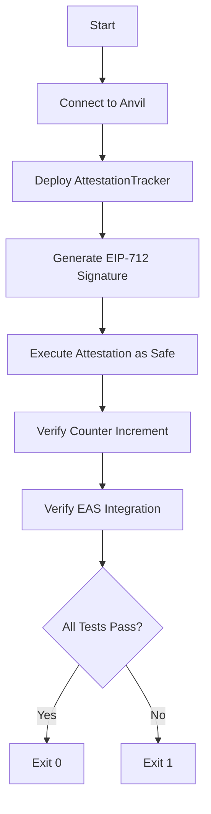

# CI Testing Suite

## Overview

This directory contains continuous integration testing tools for the Quorum AI project. The main component is the `test_attestation_tracker_ci.py` script which provides comprehensive end-to-end testing of the AttestationTracker contract, suitable for CI/CD pipelines.

## What It Tests

1. **Contract Deployment**: Deploys AttestationTrackerFixed with correct EAS configuration
2. **SafeService Integration**: Simulates exact flow used by SafeService
3. **Counter Verification**: Confirms attestation counter increments correctly
4. **EAS Integration**: Verifies successful attestation creation through EAS

## Prerequisites

### 1. Start Anvil Fork
```bash
anvil --fork-url https://mainnet.base.org --auto-impersonate
```

### 2. Build Contracts (if needed)
```bash
cd contracts
forge build
```

## Running the Test

### Quick Start
```bash
# Use the automated runner script
./ci/run-attestation-ci.sh
```

### Direct Execution
```bash
# From project root
./ci/test_attestation_tracker_ci.py
```

### In CI Pipeline
```bash
# Start Anvil in background
anvil --fork-url $BASE_RPC_URL --auto-impersonate &
ANVIL_PID=$!

# Wait for Anvil to be ready
sleep 5

# Run test
./ci/test_attestation_tracker_ci.py
EXIT_CODE=$?

# Cleanup
kill $ANVIL_PID

# Exit with test result
exit $EXIT_CODE
```

## Exit Codes

- `0`: All tests passed ✅
- `1`: Test failure ❌
- `2`: Setup/connection error 🚫

## Test Flow



## Key Features

### 🎨 Colored Output
- Green ✅ for success
- Red ❌ for errors
- Yellow ℹ️ for info
- Clear section headers

### 🔍 Automatic Interface Detection
The script automatically detects whether the contract uses:
- 12-parameter interface (AttestationTrackerFixed)
- 4-parameter interface (original AttestationTracker)

### 💰 Gas Reporting
Reports gas usage for:
- Contract deployment (~505,339 gas)
- Attestation execution (~387,583 gas)

### 🔐 Proper EIP-712 Signatures
Uses correct domain parameters:
- Name: `EIP712Proxy`
- Version: `1.2.0`
- Verifying Contract: `0xF095fE4b23958b08D38e52d5d5674bBF0C03cbF6`

## Configuration

Key addresses (Base mainnet):
```python
EIP712_PROXY = "0xF095fE4b23958b08D38e52d5d5674bBF0C03cbF6"
SAFE_ADDRESS = "0x07edA994E013AbC8619A5038455db3A6FBdd2Bca"
SCHEMA_UID = "0x56e7ff73404d5c8102a063b9efeb4b992c90b01c9c958de4c2baae18340f242b"
```

## Success Output

```
================================================================================
TEST SUMMARY
================================================================================
✅ ALL TESTS PASSED!

✅ AttestationTracker deployed successfully
✅ Attestation executed through Safe
✅ Counter incremented correctly
✅ EAS integration working
```

## Troubleshooting

### Connection Error
```
❌ Failed to connect to Anvil
```
**Solution**: Ensure Anvil is running with Base fork

### Contract Not Found
```
❌ Contract artifacts not found
```
**Solution**: Run `forge build` in contracts directory

### Attestation Failure
```
❌ Attestation failed: execution reverted
```
**Solution**: Check that:
1. Contract deployed with correct EAS address
2. Signature domain matches EIP712Proxy
3. Schema exists on Base

## Integration with GitHub Actions

```yaml
name: AttestationTracker Tests

on: [push, pull_request]

jobs:
  test:
    runs-on: ubuntu-latest
    
    steps:
    - uses: actions/checkout@v3
    
    - name: Install Foundry
      uses: foundry-rs/foundry-toolchain@v1
      
    - name: Install uv
      uses: astral-sh/setup-uv@v3
      
    - name: Build Contracts
      run: |
        cd contracts
        forge build
        
    - name: Run AttestationTracker CI Test
      run: |
        # Start Anvil
        anvil --fork-url ${{ secrets.BASE_RPC_URL }} --auto-impersonate &
        sleep 5
        
        # Run test
        ./scripts/test_attestation_tracker_ci.py
```

## Dependencies

The script uses uv with inline dependencies:
- `web3==7.6.0`
- `eth-account==0.13.4`
- `pydantic==2.10.3`
- `colorama==0.4.6`

These are automatically installed when the script runs.

## Maintenance

To update the test for new contract versions:
1. Update contract paths if needed
2. Adjust interface detection logic if ABI changes
3. Update expected gas values if significant changes occur

## Related Files

- `/contracts/src/AttestationTrackerFixed.sol` - Fixed contract implementation
- `/contracts/src/AttestationTrackerOptimized.sol` - Optimized version with structs
- `/contracts/foundry.toml` - Compiler configuration with `via_ir = true`
- `/scripts/test_eas_e2e_validation.py` - Direct EAS testing script