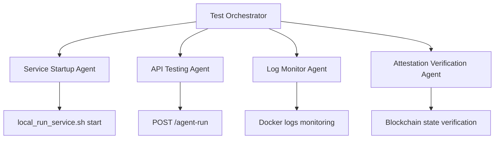

# Quorum AI End-to-End Test Plan

This test plan orchestrates a complete end-to-end test of the Quorum AI system using the local_run_service.sh script and subagents to validate the full agent run workflow, including attestation verification.

## Overview

The test plan will:
1. Start all local services (Anvil blockchain fork + Docker container)
2. Wait for services to be fully operational
3. Trigger first agent run via `/agent-run` endpoint
4. Monitor logs for successful execution
5. Wait for completion and trigger second agent run
6. Verify attestations are created on local blockchain
7. Clean up services

## Test Architecture



## Prerequisites

- Docker installed and running
- Anvil (Foundry) installed
- Node.js and npm available
- Port 8545 and 8716 available
- OpenRouter API key configured (for full testing)

## Test Steps

### Phase 1: Service Initialization

#### Step 1.1: Start Services
**Agent:** `service-startup-agent`
**Action:** Execute local service startup
```bash
./local_run_service.sh start
```

**Expected Results:**
- Anvil blockchain fork running on port 8545
- Docker container running with Quorum AI service
- Health check responding at `http://localhost:8716/healthcheck`
- EAS and Attestation Tracker contracts verified

**Success Criteria:**
- All services report healthy status
- API endpoints accessible
- Blockchain fork synchronized

#### Step 1.2: Verify Service Health
**Agent:** `health-verification-agent`
**Action:** Comprehensive health verification
```bash
./local_run_service.sh status
curl -f http://localhost:8716/healthcheck
curl -f http://localhost:8716/docs
```

**Expected Results:**
- Status command shows all services green
- Health endpoint returns valid JSON with `is_tm_healthy: true`
- API documentation accessible

#### Step 1.3: Check Endpoint Documentation and Configure OpenRouter Key
**Agent:** `configuration-agent`
**Action:** Verify API documentation and configure OpenRouter API key
```bash
# Check endpoint documentation to find available endpoints
curl -f http://localhost:8716/docs

# Find the correct endpoint for setting OpenRouter API key from the documentation
# Then configure OpenRouter API key via the appropriate HTTP endpoint (required for full testing)
# Note: Replace YOUR_OPENROUTER_KEY with actual key and use correct endpoint from docs

# Verify configuration took effect by checking health again
curl -f http://localhost:8716/healthcheck

# Check the .env file for the OpenRouter key configuration
docker exec quorum_app cat /app/.env
```

**Expected Results:**
- API documentation is accessible and shows available endpoints including `/agent-run`
- Correct endpoint for OpenRouter key configuration is identified from docs
- OpenRouter API key is properly configured via the appropriate HTTP endpoint
- Health check continues to pass after configuration
- .env file contains the configured OpenRouter API key

### Phase 2: First Agent Run

#### Step 2.1: Initiate First Agent Run
**Agent:** `api-testing-agent`
**Action:** Trigger agent run via REST API
```bash
curl -X POST http://localhost:8716/agent-run \
  -H "Content-Type: application/json" \
  -d '{
    "space_id": "quorum-ai.eth",
    "dry_run": false
  }'
```

**Expected Response:**
```json
{
  "space_id": "quorum-ai.eth",
  "proposals_analyzed": <number>,
  "votes_cast": [...],
  "user_preferences_applied": true,
  "execution_time": <number>,
  "errors": []
}
```

#### Step 2.2: Monitor First Run Execution
**Agent:** `log-monitor-agent`
**Action:** Trail Docker container logs for agent run progress
```bash
# Monitor Docker logs in real-time
docker logs -f quorum_app --since="1m" | grep -E "(agent|run|proposal|vote|attestation)"

# Also monitor internal log.txt file
docker exec quorum_app tail -f /app/log.txt | grep -E "(agent|run|proposal|vote|attestation)"
```

**Expected Log Patterns:**
- `[INFO] [agent] Starting agent run for space: quorum-ai.eth`
- `[INFO] [snapshot] Fetching proposals from space: quorum-ai.eth`
- `[INFO] [ai] Analyzing proposal: <proposal_id>`
- `[INFO] [voting] Casting vote for proposal: <proposal_id>`
- `[INFO] [attestation] Creating attestation for vote: <vote_id>`
- `[INFO] [agent] Agent run completed successfully`

**Success Criteria:**
- No ERROR level logs during execution
- Clear progression through all workflow stages
- Successful completion message

#### Step 2.3: Wait for First Run Completion
**Agent:** `execution-monitor-agent`
**Action:** Monitor API response and logs until completion
```bash
# Wait for agent run to complete (timeout: 120 seconds)
timeout 120 bash -c 'while true; do
  if docker logs quorum_app --since="1m" | grep -q "Agent run completed"; then
    echo "First agent run completed"
    break
  fi
  sleep 5
done'
```

### Phase 3: Second Agent Run

#### Step 3.1: Wait Before Second Run
**Action:** Sleep to simulate realistic timing
```bash
sleep 30
```

#### Step 3.2: Initiate Second Agent Run
**Agent:** `api-testing-agent`
**Action:** Trigger second agent run
```bash
curl -X POST http://localhost:8716/agent-run \
  -H "Content-Type: application/json" \
  -d '{
    "space_id": "quorum-ai.eth",
    "dry_run": false
  }'
```

#### Step 3.3: Monitor Second Run Execution
**Agent:** `log-monitor-agent`
**Action:** Monitor second execution cycle
```bash
docker logs -f quorum_app --since="2m" | grep -E "(agent|run|proposal|vote|attestation)" | tail -50
```

### Phase 4: Attestation Verification

#### Step 4.1: Verify Blockchain Attestations
**Agent:** `attestation-verification-agent`
**Action:** Query blockchain for created attestations
```bash
# Check attestation count via status command
./local_run_service.sh status

# Direct blockchain query for attestation count
curl -s -X POST http://localhost:8545 \
  -H "Content-Type: application/json" \
  -d '{
    "jsonrpc": "2.0",
    "method": "eth_call",
    "params": [{
      "to": "0x9BC8c713a159a028aC5590ffE42DaF0d9A6467AC",
      "data": "0x8d8c0063"
    }, "latest"],
    "id": 1
  }' | jq -r '.result'
```

**Expected Results:**
- Attestation count > 0 (at least 1 attestation from agent runs)
- Status command shows attestation activity
- Blockchain state reflects successful transactions

#### Step 4.2: Verify Attestation Content
**Agent:** `attestation-verification-agent`
**Action:** Validate attestation data quality
```bash
# Query recent attestations from logs
docker logs quorum_app | grep -E "attestation.*created|attestation.*confirmed" | tail -10
```

**Expected Attestation Data:**
- Valid EAS schema format
- Proposal ID reference
- Vote decision data
- Agent address as attester
- Transaction hash confirmation

### Phase 5: Test Validation and Cleanup

#### Step 5.1: Comprehensive Results Validation
**Agent:** `results-validation-agent`
**Action:** Validate all test criteria
```bash
# Verify service health after runs
curl -f http://localhost:8716/healthcheck | jq '.attestation_tracker.attestation_count'

# Check for any error logs
docker logs quorum_app | grep -i error | wc -l

# Verify blockchain connectivity
curl -s -X POST http://localhost:8545 -H "Content-Type: application/json" -d '{"jsonrpc":"2.0","method":"eth_blockNumber","params":[],"id":1}' | jq -r '.result'
```

#### Step 5.2: Cleanup Services
**Action:** Clean shutdown of all services
```bash
./local_run_service.sh stop
```

**Expected Results:**
- All Docker containers stopped and removed
- Anvil process terminated
- Temporary files cleaned up
- Ports released

## Success Criteria

### Critical Requirements
- [ ] Both agent runs complete without errors
- [ ] At least 1 attestation created on blockchain
- [ ] All services start and stop cleanly
- [ ] API endpoints respond correctly
- [ ] Log files contain expected workflow progression

### Quality Indicators
- [ ] Response times < 60 seconds per agent run
- [ ] Zero ERROR level log entries
- [ ] Proper attestation data structure
- [ ] Clean service health throughout test
- [ ] Memory usage remains stable

## Failure Scenarios and Recovery

### Service Startup Failures
- **Symptom:** Port conflicts or container startup errors
- **Recovery:** Stop all services, check port availability, restart
- **Prevention:** Pre-flight port checks in test script

### API Timeout Failures  
- **Symptom:** Agent run requests timeout or hang
- **Recovery:** Container restart, check OpenRouter API key
- **Investigation:** Check Docker logs and health endpoints

### Attestation Failures
- **Symptom:** Zero attestations despite successful runs
- **Recovery:** Verify blockchain connectivity and contract addresses
- **Investigation:** Check EAS contract interaction logs

## Implementation Script Structure

```bash
#!/bin/bash
# orchestrate-test.sh

set -e

# Test configuration
TIMEOUT_AGENT_RUN=120
TIMEOUT_ATTESTATION_CHECK=60
TEST_SPACE="quorum-ai.eth"

# Phase 1: Start services
echo "Phase 1: Starting services..."
./local_run_service.sh start

# Wait for health
wait_for_health() {
  local max_attempts=30
  local attempt=0
  while [ $attempt -lt $max_attempts ]; do
    if curl -sf http://localhost:8716/healthcheck > /dev/null; then
      echo "Services healthy"
      return 0
    fi
    attempt=$((attempt + 1))
    sleep 2
  done
  return 1
}

wait_for_health || exit 1

# Phase 2: First agent run
echo "Phase 2: First agent run..."
first_response=$(curl -X POST http://localhost:8716/agent-run \
  -H "Content-Type: application/json" \
  -d "{\"space_id\": \"$TEST_SPACE\", \"dry_run\": false}")

echo "First run response: $first_response"

# Monitor completion
timeout $TIMEOUT_AGENT_RUN bash -c 'while ! docker logs quorum_app --since="2m" | grep -q "Agent run completed"; do sleep 5; done'

# Phase 3: Second agent run  
echo "Phase 3: Second agent run..."
sleep 30

second_response=$(curl -X POST http://localhost:8716/agent-run \
  -H "Content-Type: application/json" \
  -d "{\"space_id\": \"$TEST_SPACE\", \"dry_run\": false}")

echo "Second run response: $second_response"

timeout $TIMEOUT_AGENT_RUN bash -c 'while ! docker logs quorum_app --since="2m" | grep -q "Agent run completed"; do sleep 5; done'

# Phase 4: Attestation verification
echo "Phase 4: Verifying attestations..."
./local_run_service.sh status | grep -E "attestation|Total"

# Get attestation count from blockchain
attestation_count=$(curl -s -X POST http://localhost:8545 \
  -H "Content-Type: application/json" \
  -d '{
    "jsonrpc": "2.0",
    "method": "eth_call", 
    "params": [{
      "to": "0x9BC8c713a159a028aC5590ffE42DaF0d9A6467AC",
      "data": "0x8d8c0063"
    }, "latest"],
    "id": 1
  }' | jq -r '.result')

if [ "$attestation_count" = "0x" ] || [ -z "$attestation_count" ]; then
  echo "FAIL: No attestations found on blockchain"
  exit 1
else
  count=$((16#${attestation_count:2}))
  echo "SUCCESS: Found $count attestations on blockchain"
fi

# Phase 5: Cleanup
echo "Phase 5: Cleaning up..."
./local_run_service.sh stop

echo "END-TO-END TEST COMPLETED SUCCESSFULLY"
```

## Subagent Task Delegation

### Service Startup Agent
**Role:** `service-startup-coordinator`
**Responsibilities:**
- Execute local_run_service.sh with proper error handling
- Verify all services reach healthy state
- Report startup metrics and timing

### API Testing Agent  
**Role:** `api-interaction-specialist`
**Responsibilities:**
- Execute REST API calls with proper headers and payloads
- Parse and validate API responses
- Handle timeout and retry logic

### Log Monitor Agent
**Role:** `log-analysis-specialist` 
**Responsibilities:**
- Tail Docker container logs in real-time
- Filter and categorize log entries by importance
- Detect completion and error patterns

### Attestation Verification Agent
**Role:** `blockchain-verification-specialist`
**Responsibilities:**
- Query blockchain state for attestation data
- Verify transaction confirmations
- Validate attestation data structure and content

This test plan provides comprehensive validation of the Quorum AI system's end-to-end functionality while using specialized subagents to handle different aspects of the testing process.